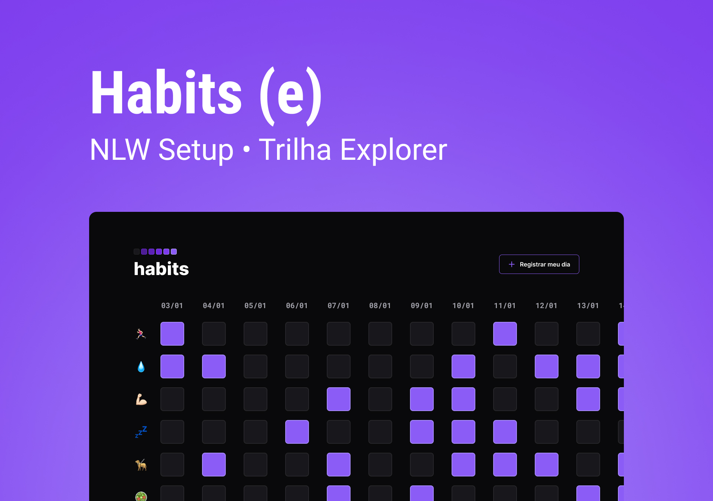

<h1 align="center"> Habits </h1>

NLW é um evento exclusivo e gratuito, promovido pela Rocketseat para ensino de tecnologias WEB.
 

  <a href="#-tecnologias">Tecnologias</a> &nbsp;|
  <a href="#-projeto"> Projeto</a> &nbsp;|
  <a href="#-layout"> Layout</a> &nbsp;|
  <a href="#memo-licença"> Licença</a>
  

   
  

    
  

## 💻 Tecnologias

Esse projeto foi desenvolvido com as seguintes tecnologias:

- HTML e CSS
- JAvaScript
- Git e Github
- Figma

## 📝 Projeto

O Habits é um app para ajudar a rastrear os hábitos diários de uma pessoa.

- [Visite o projeto online](https://marivida.github.io/NLW_Setup_habitos_diarios/)

## 💀 Layout

Você pode visualizar o layout do projeto através [DESSE LINK](https://www.figma.com/community/file/1195327109778210238). É necessário ter conta no [Figma](https://figma.com) para acessá-lo.

## :memo: Licença

Este projeto está sob a Licença da Rocketseat.

---

Feito com o 💟 by Mariana Vida
